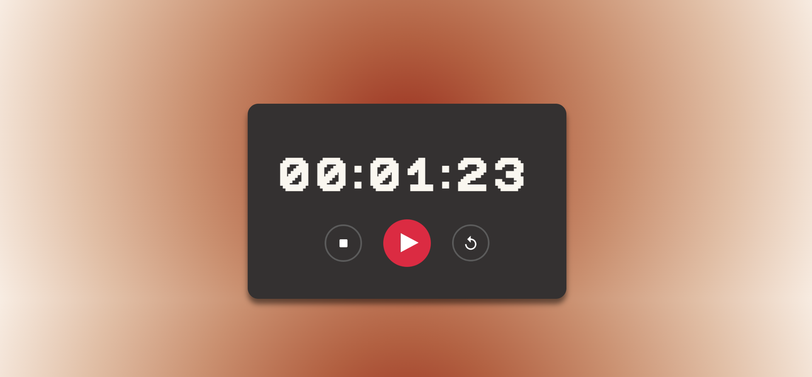

🕒 Stopwatch
A simple and functional stopwatch built using HTML, CSS, and JavaScript.

## 🚀 Live Demo

🔗 [Click here to view](https://codestellatixn.github.io/js-stopwatch/)

📸 Screenshot

## 📌 Features
✅ Start, Stop, and Reset functionality
✅ Displays time in HH : MM : SS format

## How to Use

1. Click the **Start** button to begin counting time.
2. Click **Stop** to pause.
3. Click **Reset** to reset the stopwatch.
